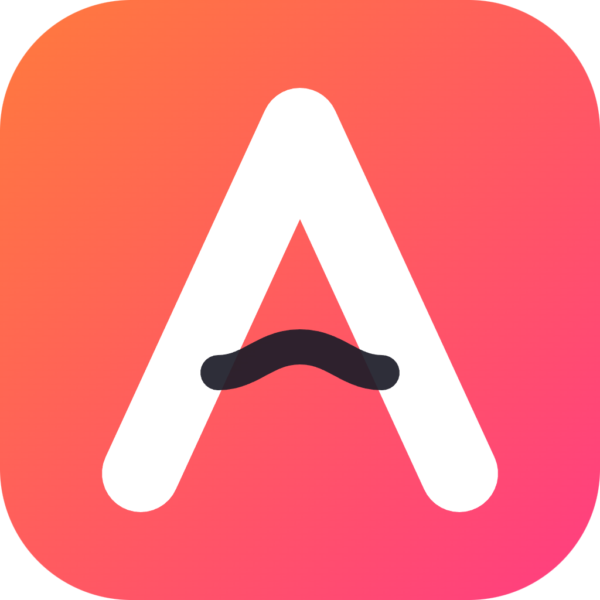
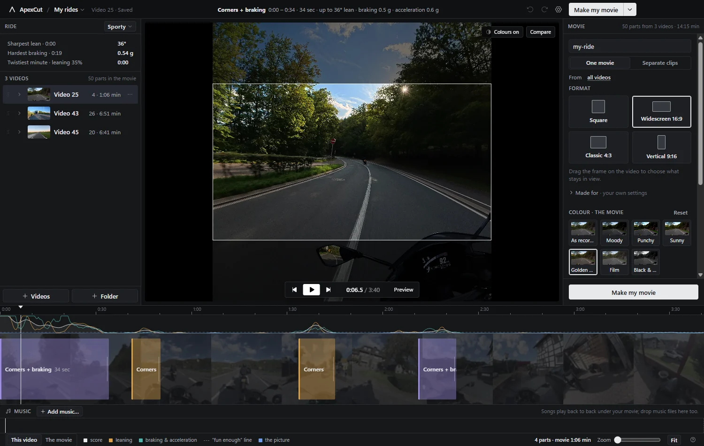

<div align="center">



# ApexCut

**Your best corners, already found.**

Your helmet camera writes down how the bike moved, thirty times a second, in every recording.
ApexCut reads it, finds the corners, the braking and the hard acceleration, and hands you a movie of
the good bits — on your own computer, without uploading anything.

[](https://github.com/DarrellVS/apexcut/releases/latest)
[](https://github.com/DarrellVS/apexcut/actions/workflows/ci.yml)
[](https://github.com/DarrellVS/apexcut/releases/latest)
[](LICENSE)

**[Download](https://github.com/DarrellVS/apexcut/releases/latest) · [Website](https://darrellvs.github.io/apexcut/) · [Documentation](https://darrellvs.github.io/apexcut/docs.html)**



</div>

## What it does

- **Finds the good bits by itself.** Lean, sustained turning, braking and acceleration are scored
  from the camera's own motion track. No video is decoded, so a 22 minute ride is scanned in about
  a second.
- **Puts them on a timeline you can edit.** Trim an edge, join a chain of corners into one sweep,
  leave one out, star the best, add your own. Undo and redo everywhere.
- **Makes the movie.** Widescreen, vertical, 4:3 or the square as recorded, with crossfades, colour
  looks, music, a telemetry overlay and one button.
- **Keeps the bits you point at.** Two fingers held up to the camera while riding marks that spot;
  ApexCut finds the gesture and keeps the ten seconds before it.
- **Lets the picture vote, if you want.** Tunnels, fast light changes, low evening sun and busy
  roads can add moments the sensor cannot see — and each one says why it was picked.
- **Hands it to your phone.** “Send to my phone” serves the finished movie over your own Wi-Fi
  behind a QR code. Nothing is uploaded, and the link dies after half an hour.
- **Sums up the day.** A ride card with your sharpest lean, hardest braking, corner count and
  minutes of real riding, straight to the clipboard.

## How it works

1. **Point it at a card or a folder.** Recordings are paired with the small proxy the camera wrote
   next to them (`.LRF` on DJI, `.LRV` on GoPro) and grouped by riding day.
2. **The motion track is read, not the pixels.** `djmd` (DJI) or `gpmd`/GPMF (GoPro) is copied out
   and scored; GoPro's accelerometer and gyroscope are fused into an attitude first.
3. **You edit and export.** The parts land on the timeline; the export crops at full resolution and
   never scales anything.

## Cameras

| Camera                | What it gives                                         | Notes                                                                                                                  |
| --------------------- | ----------------------------------------------------- | ---------------------------------------------------------------------------------------------------------------------- |
| DJI Osmo Action       | 30 Hz attitude quaternion + accelerometer             | Read straight out. See [docs/dji-metadata.md](docs/dji-metadata.md)                                                    |
| GoPro Hero5 and newer | GPMF accelerometer + gyroscope (and `CORI` on Hero8+) | Fused into an attitude; within a few degrees of the camera's own. See [docs/gopro-metadata.md](docs/gopro-metadata.md) |
| Anything else         | —                                                     | Says so plainly; you can still cut by hand                                                                             |

## What comes out

| Rule            | What it means                                                                                 |
| --------------- | --------------------------------------------------------------------------------------------- |
| Resolution      | Never scaled — a format crops the recording at full resolution (3840 × 2160, 2160 × 3840, …)  |
| Colour depth    | 10-bit stays 10-bit, through the colour work and the encode                                   |
| Square format   | Stream copy: the exported parts are the original bytes, cut at the nearest keyframe           |
| Everything else | HEVC at CQ 18 on NVENC / QuickSync / AMF, libx265 fallback, bitrate cap scaled by kept pixels |
| Sound           | The ride's own sound, music under it, and an optional −14 LUFS pass                           |
| Your files      | Read-only. Movies land in a folder you choose                                                 |

## Install

Grab the installer or the portable build from the
[latest release](https://github.com/DarrellVS/apexcut/releases/latest). Windows 10 or 11, 64-bit.
The installer keeps itself up to date; the portable build leaves nothing behind.

Windows will warn about an unknown publisher — the builds are not signed with a paid certificate.

## Documentation

- [How to use it](https://darrellvs.github.io/apexcut/docs.html) — adding rides, the timeline,
  colours, music, exporting, sharing, shortcuts, troubleshooting.
- [Scoring](docs/scoring.md) — what counts as a corner, and every threshold behind it.
- [Gestures](docs/gestures.md) — how the two-finger mark is found, and how well it works.
- [Architecture](docs/architecture.md) · [Design](docs/design.md) — how the app is put together.

## Building from source

Node 22 (`.nvmrc`) and npm. ffmpeg and ffprobe come from npm.

```bash
npm install
npm run dev            # Electron + Vite with hot reload
npm run check          # lint + typecheck + unit tests
npm run test:e2e       # builds, then drives the real app with Playwright
npm run build:win      # installer + portable build in dist/
```

End-to-end tests never run in CI: they are the gate before a release is built on a real machine
(`npm run check:pre-release`, which `npm run build:win` depends on).

`src/core` is pure TypeScript — parsing, IMU maths, scoring, framing, the gesture detector — and is
unit-tested against fixtures, including the metadata of GoPro's own sample recordings and a parity
fixture from the Python prototype this was ported from.

## Command line

- `ApexCut --add=<file-or-folder>` adds videos and scans them on startup.

## Releasing

Tag `vX.Y.Z` on `main`. GitHub Actions builds the installer and the portable build, and publishes a
release with the auto-update feed.

## Licence

MIT © Darrell van Swinderen
